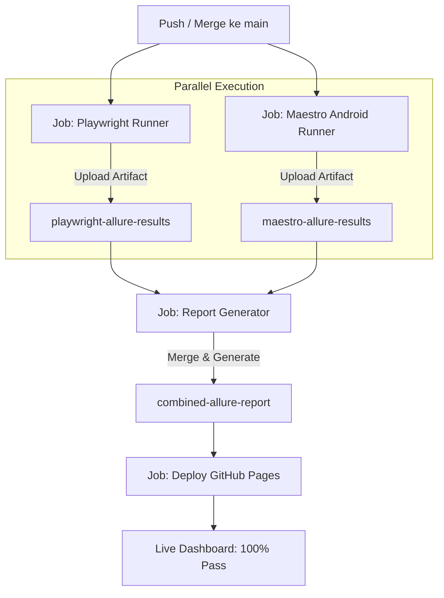

# eDOT Automation — Web & Mobile Test Framework

Repository ini berisi implementasi **Automation Testing End-to-End** sebagai bagian dari **Take Home Test QA Automation Engineer eDOT**.

Project ini mencakup pengujian menyeluruh pada dua platform utama eDOT:

1. 🌐 **Web Application (eSuite)** — Menggunakan **Playwright + Pytest (Python)**
2. 📱 **Mobile Android Application (eWork SFA)** — Menggunakan **Maestro + Pytest (Python)**

Kedua platform diintegrasikan ke dalam satu arsitektur terpadu dengan **Combined Allure Reporting**, baik saat dijalankan secara lokal maupun secara otomatis di **GitHub Actions CI/CD** yang berjalan secara **parallel** dan ter-publish langsung ke **GitHub Pages**.

---

## 🌟 Live Report & CI/CD Status

| Resource                           | Link / Detail                                                                                                      |
| ---------------------------------- | ------------------------------------------------------------------------------------------------------------------ |
| 🌐 **Live Combined Allure Report** | [https://suryana-code.github.io/eDOT-Automation/](https://suryana-code.github.io/eDOT-Automation/)                 |
| 🚀 **GitHub Actions Pipeline**     | [https://github.com/suryana-code/eDOT-Automation/actions](https://github.com/suryana-code/eDOT-Automation/actions) |
| 📊 **Status Suite Allure**         | **100% Pass** (Playwright 14 tests + Maestro 1 test)                                                               |

---

## 🏗️ Struktur Project

```
eDOT-Automation
├── .allure/                  # Runtime Allure results & merged report (lokal/CI)
├── .github/
│   └── workflows/
│       ├── automation.yaml   # 🚀 Main CI: Parallel Playwright + Maestro -> Combined Allure -> Pages
│       ├── playwright.yaml   # 🛠️ Standalone Playwright CI (Manual dispatch)
│       └── maestro.yaml      # 🛠️ Standalone Maestro CI (Manual dispatch)
├── Makefile                  # Root orchestrator (Parallel execution lokal)
├── .env.example              # Template environment variables bersama
├── Playwright/               # 🌐 Web Automation Framework (eSuite)
│   ├── pages/                # Page Object Model (POM)
│   ├── tests/                # Test cases & failure triage tests
│   ├── utils/                # AI data generator, failure triage, helpers
│   ├── auth/                 # Session authentication cache (storage_state)
│   ├── Makefile              # Individual Playwright runner
│   └── README.md             # Dokumentasi lengkap Web automation
└── Maestro/                  # 📱 Mobile Automation Framework (eWork SFA)
    ├── flows/                # Maestro YAML flows (login, create customer, verify)
    ├── pytest/               # Pytest wrapper, dynamic customer data & Allure reporter
    ├── recordings/           # Video screen recordings runtime evidence
    ├── Makefile              # Individual Maestro runner
    └── README.md             # Dokumentasi lengkap Mobile automation
```

---

## ⚡ Eksekusi Lokal

### 1. Menjalankan Suite Secara Individual

Masing-masing framework dapat dijalankan secara mandiri dari foldernya:

```bash
# Web Automation (Playwright)
cd Playwright
make test             # Mode headless
make headed           # Mode browser terlihat
make allure           # Test + buka Allure report lokal

# Mobile Automation (Maestro)
cd Maestro
make test             # Jalankan test suite mobile
make allure           # Test + buka Allure report lokal
```

### 2. Menjalankan Combined Report (Web + Mobile Parallel)

Untuk menjalankan **Playwright dan Maestro secara parallel** dalam 1 eksekusi lokal dan menggabungkannya ke dalam 1 Allure Report terpadu, jalankan dari **root repository**:

```bash
make test-all         # Menjalankan Web dan Mobile secara parallel & merge results ke .allure/results/
make generate-all     # Men-generate Allure HTML report ke .allure/report/
make open-all         # Membuka report gabungan di browser
make allure-all       # Menjalankan seluruh alur: test parallel -> generate -> buka report
make clean-all        # Membersihkan folder runtime .allure/
```

- `make test-all` membersihkan `.allure/` terlebih dahulu, menjalankan Playwright ke `.allure/playwright-results/` dan Maestro ke `.allure/maestro-results/` secara **parallel background process**, lalu otomatis menggabungkan seluruh evidence ke `.allure/results/`.
- Pada Allure Report (`SUITES`), hasil terbagi menjadi:
  - **`Playwright`** ➔ `Web Automation`
  - **`Maestro`** ➔ `Mobile Automation`

---

## 🔄 CI/CD Workflow (GitHub Actions)

Alur otomatisasi pada GitHub Actions dirancang modern, modular, dan resilien:



### Karakteristik Workflow:

1. **Parallel Execution**: Saat terdapat event `push`/`merge` ke branch `main`, workflow [`.github/workflows/automation.yaml`](.github/workflows/automation.yaml) menjalankan job `playwright` dan `maestro` secara parallel.
2. **Android Emulator di Cloud**: Runner Maestro menginisialisasi Android Emulator API 30, menginstal paket APK aplikasi eWork SFA, menjalankan Maestro flow, merekam layar MP4, dan mengumpulkan artifact debug.
3. **Resilien & Safe Fallback**: Dilengkapi mekanisme fallback synthetic Allure result untuk memastikan artifact selalu tersedia dan reporting tidak terputus.
4. **Automated Publishing**: Job `report` menggabungkan Allure results dari kedua job, membangun Allure HTML dashboard tunggal, lalu job `deploy` mempublikasikannya ke **GitHub Pages**.
5. **Standalone Manual Dispatch**: Workflow [`.github/workflows/playwright.yaml`](.github/workflows/playwright.yaml) dan [`.github/workflows/maestro.yaml`](.github/workflows/maestro.yaml) tersedia untuk eksekusi manual independen bila diperlukan.

---

## 📌 Ringkasan Fitur & Framework

### 🌐 Web Automation (Playwright)

- **Target**: Aplikasi Web **eSuite**
- **Arsitektur**: Page Object Model (POM) + Pytest + Playwright (Python)
- **Skenario**:
  - Login & Session Auth Caching (`storage_state.json`)
  - Create Company dengan multi-step wizard (Location cascade & Auto Postal Code)
  - Verify Card & Status `Active`
  - Verify Detail Company (Tier 2 validation)
  - Automatic Cleanup / Deletion
- **Inovasi Tambahan**:
  - **AI Test Data Generator** via OpenAI API dengan schema validation Pydantic & deterministic Faker fallback.
  - **AI Failure Triage Engine** untuk analisis post-run secara read-only.
  - **Auto Screenshot on Failure** terlampir otomatis ke Allure.
- _Dokumentasi lengkap: [`Playwright/README.md`](Playwright/README.md)_

### 📱 Mobile Automation (Maestro)

- **Target**: Aplikasi Android **eWork SFA** (`id.edot.ework`)
- **Arsitektur**: Maestro Declarative YAML Flows + Pytest Wrapper + Allure Lifecycle
- **Skenario**:
  - Login & Dashboard Verification
  - Create Customer (NOO Registration) dengan Upload Dokumen KTP & Digital Signature swipe
  - Verify Customer pada New Customer List
- **Fitur Tambahan**:
  - Dynamic Indonesian customer data via Faker
  - Otomatis merekam video eksekusi (`.mp4`) & screenshot per flow yang dilampirkan langsung ke step Allure.
- _Dokumentasi lengkap: [`Maestro/README.md`](Maestro/README.md)_

---

## ⚖️ Disclaimer & Larangan Plagiarisme

> [!CAUTION]
> **PERINGATAN HAK CIPTA & INTEGRITAS ASSESSMENT (ANTI-PLAGIARISM NOTICE):**
>
> 1. Repository ini dibuat dan dipublikasikan secara terbuka **HANYA sebagai portofolio publik dan bahan referensi edukasi** atas nama **Muhamad Suryana**.
> 2. **DILARANG KERAS** menyalin, menduplikasi, memodifikasi sebagian atau seluruh kode/flow/arsitektur dalam repository ini untuk di-submit sebagai hasil pengerjaan **Take Home Test / Technical Assessment QA Automation Engineer di eDOT** atau perusahaan lainnya.

---

## 👨‍💻 Author

**Muhamad Suryana**  
QA Automation Engineer  
🌐 Portfolio: [www.msuryana.site](https://www.msuryana.site)

<!-- Digital Signature: 5urY4n4_eDOT_Auth_2026 | Sury@n@ | msuryana -->
